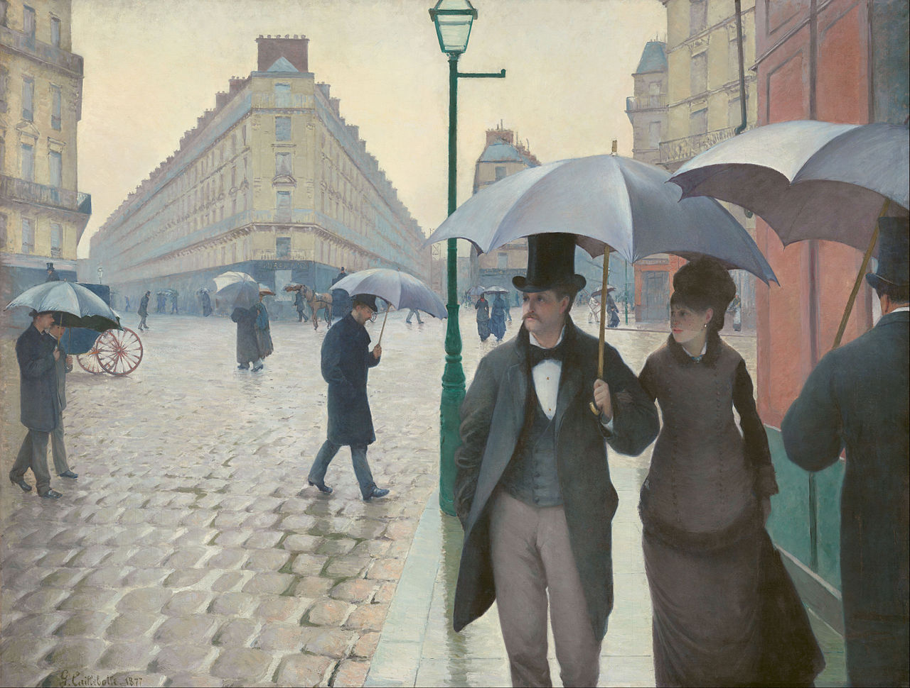
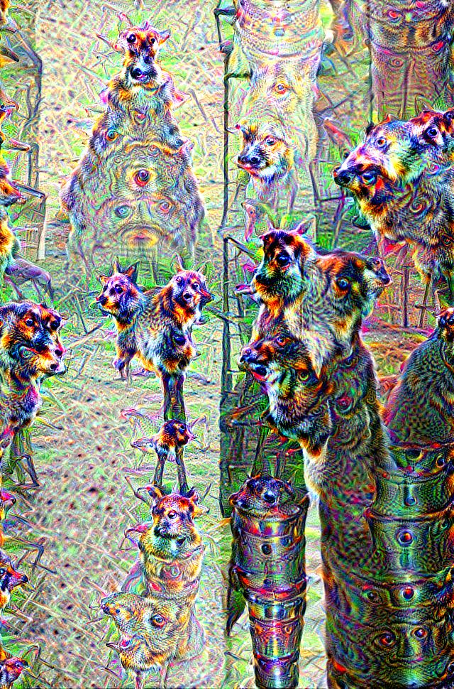

# HW9 
This homework was completed solo.  
All work done by: Siddharth Patel  

|Figure 1 : Original Image|
| :----------------------------------------------------------: |
|  |

|Figure 2 : Updated DeepDream Image|
| :----------------------------------------------------------: |
|  |

### 1:
This homework was about working with the DeepDream Neural Network, and just experimenting with the weird things it can produce.  

### 2:
The hardest part of this homework was scaling the image to a proper size.  

### 3:
Generally the homework was easy overall, nothing too easy.  

### 4:
One new thing I learned was how the fine tuning of parameters can change the final image from DeepDream, as well as the variety 
of outputs from the different layers.  
